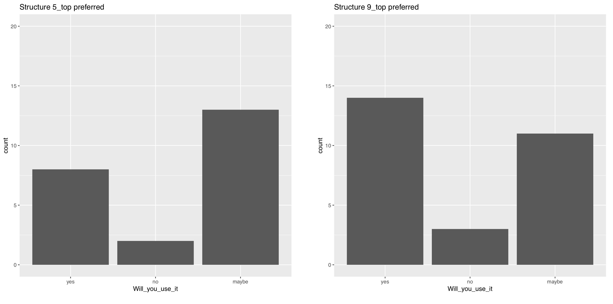

# Summary

In contrast to software developers, researchers mostly do not organize their files according to some common standard.
While data managers recommend to design such an organisation,
they fail at providing clear recommendations or examples;
and there is no time specifically assigned to this task in the researcher's work.
We believe that providing researchers with a commonly accepted folder tree structure template could make a huge difference in promoting data management and research collaboration.
In this blog, we present the results of an initial survey run in three neuroscientific research consortia (LINK).

We collected the feedback from 51 neuroscientists presented with two initial template drafts,
analysed their responses,
and built an updated template based on the feedback that is presented here.
This new template takes three levels of data organisation into account (laboratory, project, and experiment),
while staying fairly simple and flexible, especially when implemented it in a git workflow (using the GIN-tonic tool we are developing).
Researchers from all research domains are now invited to review this draft in a second survey (run until mid January 2021, LINK).  

# Introduction

Every day, researchers spend time doing file management on their computers (creating, downloading, naming, moving, saving, copying, reviewing, navigating, searching for, sharing, and deleting files and folders).
While many different initiatives and tools tried to improve file management (using tags, databases and search algorithms), the use of folder tree structure appeared to be unavoidable and necessary [@dinneenUbiquitousDigitalFile2020].
In addition, both proponents of reproducible research and data management experts recommend researchers the use of an appropriate folder organizational structure ([@LibraryCarpentryLcfairresearch2019], [@theturingwaycommunityTuringWayHandbook2019]).
However, only few actually provide examples or attempts to homogenize such a structure (see [@vuorreSharingOrganizingResearch2020] and [@wilsonGoodEnoughPractices2017] for exceptions).

We -the authors of this blog post- are data managers of different institutions working with neurobiologists, and we teamed up with the NFDI Neuroscience community to develop a new strategy to support researchers with their data management.
We hypothesize that implementing a hierarchical directory structure using a template could help researchers collaborate on their projects,
and manage their data and files better.
In a first step, 
we designed two templates (see Fig. 1) and a survey to guide our efforts.
Here, we are presenting the analysis of the survey answers and a novel version of the template according to the received feedback.
The blog ends by outlining the GIN-tonic application, that brings some technical solution (based on the git submodule technology) to add flexibility and ease of use in the template.

> *How do you organise your digital files for your research projects ?* 
>
> I organise my file using the GIN research repository (version 1).

# The survey

## Two template structure

In order to obtain a practical flair in comments and feedback received,
we provided two templates, both having a similar number of folders,
but organized differently.
The 5_top template represented a more hierarchical structure,
while the 9_top template represented a more flat structure (see Fig. 1).
Then, we asked researchers to browse the folder tree while asking them to place or find specific files,
hoping researchers will make themselves familiar with the template before giving us a detailed feedback. 

## No clear preference for one or the other template. 

We ran the survey on the three involved CRCs during autumn 2020 and finally got 51 responses.
In the meantime, we prepared the analysis and finally run it on the final data to produce a reproducible report you can access here: XXX.
In general, researchers reacted very positively to the project.
Surprisingly, about half of the participants preferred one template, while the other half preferred the other one (see Fig. 2,
participants had to choose one or the other template).
This preference was highly correlated with the similarity of the template to the structure they presently use (Pearson Chi-square, p−value = 2.23e−06).
However, we could not identify any notable effect of career stage or research domain on this preference,
or any effect of this preference on willingness to use such a template.
In particular, computer scientists do not seem to differ from wet-lab researchers in these aspects.

We asked three questions about where they would save or search for specific documents in the different structures.
Researchers were indicating different folders between them, and different than the ones we designed for it,
showing that **a too detailed folder structure would not be helpful**.
On the other hand, researchers would navigate the repository to find specific files using similar strategies (Fig. 3),
suggesting that having a structure can be helpful, and may reduce the time to browse for specific information.

## Issues

Most participants could see the advantage of such an homogenization of the project management for their own work, but were critical about the **cost/benefit ratio** of such a process, especially for ongoing projects.
Many mentioned that it would only reach full impact if the whole lab would be using it, emphasizing the advantage of such a system for
collaborative work.
In addition, they mentioned the time saved by not having to create a template for themselves,
but only use an existing standard.
While they were quite unanimous about using a template for new projects, they were critical about making a transition for ongoing projects,
as the cost of transition might be too high.
More generally, they were questioning the cost over benefit ratio of changing their current organization system,
especially as learning a new workflow takes time.

In many cases, people mentioned that the **files are organized via experiments**, not at the project level.
In particular, people tend to pool data and code in a single experiment folder.
This is reminiscent of the two example structure given in the library carpentry course [@LibraryCarpentryLcfairresearch2019].

On the other hand, some **files are organised outside of project folders**, i.e.  in particular places irrespective of the project they belong to. 
Many researchers reported having a folder for all conferences reports or all manuscritps, for instance.

# The new template

Data management principles recommend to keep all files related to a project in a single folder (this facilitates sharing of these files with the whole team working on the project),
and to manage data and code differently (this allows different version control system, as well as sharing and reusing data and code independently).
We designed a template that follows these principles, 
but added some recommendations and technical solutions 
in order to permit users to have cross-project and experiment-level organisations of their files.

## The experiment level

We propose to keep data and code in different first level folder, 
and to create several new folders (in the different first level folders) for each new experiment. 
This could be easily automated in your language of choice,
and we are working on bringing this functionality to GIN-tonic (see below).
In addition, some of these new folders could also have their own templates.
For instance, you could use a specific BIDS template for some experiments, while others will use a different template.

## The project and cross-project level

We propose to mirror some folders (for shared figures, report and conference, and manuscripts) both in the project folder and in a different folder (see Fig. 4).
In addition, we would propose to add a `labcommons` folder that could be shared and synchronised between all lab members using cloud technologies. 
This all will be quite difficult to set up manually (using alias folders for example), but using the git submodule technology in GIN-tonic, it can be automated (see below).

# GIN-tonic implementation

GIN is the G-Node infrastructure, which brings similar functionalities as GitLab or GitHub, based on git and git annex technologies.
We are building a `go` extension that will facilitate some administrative tasks and automate some complex workflow linked to the use of the template.
We could not resist calling it tonic, in reference to the vigor added to the GIN tool.
In gin-tonic, sub-folders can be submodules,
meaning they can be synchronised, shared and published independently of the other sub-folders,
while looking completely normal on one's computer.
A mock-up presentation for a lab with 2 projects is available at https://gin.g-node.org/testorga.

The tonic application creates a new project repository,
following the discussed research repository template with some folders being created as submodules (see Fig. 4). These submodules are also added to some lab-level repository
In addition, a labcommons folder that contains files relevant for the whole lab will be added to all projects.
This means that for example a manuscript draft can be available at two location on ones computer, once inside a clone (cloning is similar to downloading but while keeping a link with the server version) of the project repository, and once inside a clone of the lab-level manuscript repository. Changes in either places can be synchronised to the unique version available on the server.

On the other hand, the tonic application will also be able to add submodules and folders to the parent repository for each experiment performed. A data submodule will be created, so that the data can be curated and published independently of the other experiments, while other folders will be created (). A synchronisation of the computer version will then bring these changes on the local version, ready to be filled with data, code, and figures.

Last but not least, the parent repository will come with a synchronization script that will make these synchronisation as easy as a double click. Users with git knowledge will be able to create their own workflow, as git and git annex are still the background of this technology.
Besides the GIN-tonic tooling we currently also implement this concept for GitLab-based plattforms, called Lab-tonic.

# Conclusion

We hope to provide the research community with a useful project folder structure template, which will get its full power when used inside the gin-tonic application.
Tonic will indeed automate several administrative tasks, like the production of sub-folders upon new experiments,
and come with a predefined rule for sharing one's files in the lab, and beyond. 

<!---

On one side,
the tool should both separate data and analysis code to follow good practices,
and allow for an experiment-based workflow.
We propose to use a bot to create several folders at different location for each experiment.
On the other side,
researchers normally have more than one project and some documents,
like for example conference presentations,
are better organised outside of the project structure.
We propose to use the git submodule technology to mirror these folders at different location.
Documents will be available on the project structure (for easy sharing and re-use inside a project)
and a different structure (allowing a better overview of specific work).
We finally present an hypothetical use case demonstrating the new paradigm.

--->

# References
