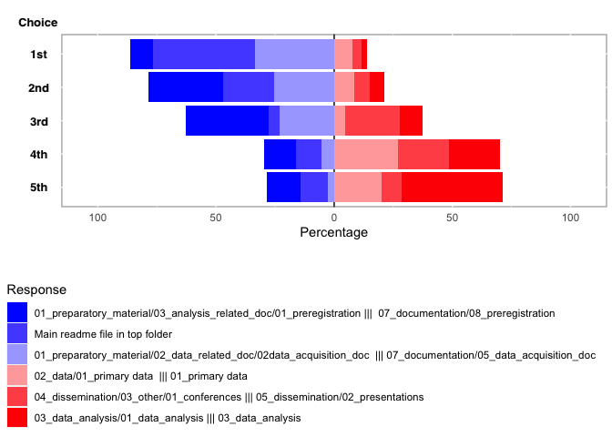

# Summary

We are data managers of different institutions working with neurobiologists.
Inside the gin-tonic project.
We wants to provide researchers with a folder structure template that can be used to organise all digital documents related to a research project.
This includes but is not restricted to the collected datasets.
We collected the feedback of about 50 researchers presented with two templates propositions.
**After presenting the analysis of the 51 survey responses,
we are discussing the shortcoming of this approach and a technological solution that would permit to circumvent them.**

On one side,
the tool should both separate data and analysis code to follow good practices,
and allow for an experiment-based workflow.
We propose to use a bot to create several folders at different location for each experiment.
On the other side,
researchers normally have more than one project and some documents,
like for example conference presentations,
are better organised outside of the project structure.
We propose to use the git submodule technology to mirror these folders at different location.
Documents will be available on the project structure (for easy sharing and re-use inside a project)
and a different structure (allowing a better overview of specific work).
We finally present an hypothetical use case demonstrating the new paradigm.

# Introduction

Researchers spend time every day doing file management on their computers (creating, downloading, naming,  moving,  saving,  copying,  reviewing,  navigating, searching for, sharing, and deleting files and folders).
While many different initiatives and tools tried to improve file management (using tags, databases and search algorithms), the use of folder tree structure appeared to be unavoidable [@dinneenUbiquitousDigitalFile2020]. 
While both reproducible research and data management advocates and experts are advising researchers to design a folder organisation structure ([@LibraryCarpentryLcfairresearch2019], [@theturingwaycommunityTuringWayHandbook2019]),
few actually provide examples or attempts to homogenize the structure (but see [@vuorreSharingOrganizingResearch2020] and [@wilsonGoodEnoughPractices2017] for exceptions).

We hypothesize that implementing a folder tree structure using a template could help researchers collaborate on their projects,
and manage their data and files better.
In a first step, 
we designed two templates and a survey to guide our efforts to develop a template that
would fit and hopefully be accepted by a large part of our community.
We are presenting here the analysis of the survey answer and a novel version of the template in accordance with the received feedback.
This blog ends by outlining the gin-tonic application, that brings some technical solution to bring more flexibility in the template,
expandind the project-bound template to deal with an experiment level and a meta-project level, using the git submodule technology. 

# The survey

## Two template structure

In order to obtain a practical flair in comments and feedback received,
we provided two templates, with a similar number of folders,
but organized differently.
The 5_top structure was more hierarchical,
while the 9_top structure was flatter (Fig. 1).
In addition, we asked researchers to browse the folder tree while asking them to place or find specific files,
hoping researchers will make themselves familiar with the template before giving us a detailed feedback. 

### No clear preference for one or the other template. 

We got 51 responses to our survey.
We prepared an analysis before the data collection and finally run it on the final data to produce a reproducible reports you can access here: XXX.
In general, researchers reacted very positively to the project.
Surprisingly, about half of the participants preferred one template, while the other half preferred the other one (Fig.2, 
participants had to choose one or the other template).
This preference  was highly correlated with the similarity of the template with the structure they were presently using (Pearson Chi-square, p−value = 2.23e−06),
while we could see no visible effect of career stage or research domain on this preference,
or any effect of this preference on willingness to use such a template.
In particular, computer scientists seem not to differ from wet-lab researchers in these aspects.

We asked three questions about where they would save or search for specific documents in the different structures.
Researchers were indicating different folders between them, and different than the ones we designed for it,
showing that a too detailed folder structure would not be helpful.
On the other hand, while not always agreeing on the first choice,
they would search in about the same order on the first 3 choices (Fig. 3),
showing that having a structure can be helpful and reduce the time to browse for specific information.   

## Cost/benefit ratio

Most participants could see the advantage of such an homogenization of the project management for their own work.
Many mentioned that it would only reach full impact if the <whole lab> would be using it, emphasizing the advantage of such a system for 
collaborative work.
In addition, they mentioned the time saved by not having to create a template for themselves,
but only use an existing standard.
While they were quite unanimous about using a template for new projects, they were critical about making a transition for ongoing projects,
as the cost of transition might be too high.
More generally, they were questioning the cost over benefit ratio of changing their current organization system,
especially as learning a new workflow can take time.

##  Shortcomings of the project-level structure

In many cases, people mentioned that the files are organized via experiments, not at the project level.
In particular, people tend to pool data and code in a single experiment folder.
This is reminiscent of the two example structure given in the library carpentry course [@LibraryCarpentryLcfairresearch2019].

On the other hand, some files are saved in particular places irrespectively of the project they belong to. 
Many researchers reported having a folder for all conferences reports or all manuscritps, for instance.

## Our analysis

One main rule of data management is to keep all files related to a project in a single folder,
and we would like to follow this principle,
because it facilitates sharing of these files with the whole team working on the project.
On the other hand, there is a value in having files organised by type and not by projects, especially for PIs, who may only be interested to access figures or conference presentation for the different projects.
We therefore propose to mirror these files both in the project folder and in a different folder.
This is technically possible using the git submodule technology: the data is only once on the server, but can be provided twice on the computer. 
Modifying one or the other version of the file will be synchronised using git technologies.

On the other hand,
the distinction between data and code is primordial for an efficient work and data management. 
Indeed, data requires a different type of version control than code,
it is therefore preferable to keep these different file types in different folders.
In addition, code should be reusable on different datasets,
it makes therefore sense to be able to share it independently of the data.
And finally, it is easy to make code read data present in a different folder and there is no technical reason to keep data and code together.
We will therefore keep an organization where the first level separate data and code.
However, we want to implement a different solution that creates new folders in the different first level folders, for each new experiment. 

# Gin-tonic solution

The gin tonic application (thats brings tonic vigor to the g-node infrastructure gin) is still in development, 
but will implement the different steps we presented above.
It relies on the git, git annex, and git submodule technologies. 
In gin-tonic, sub-folders can be submodules,
meaning they can be synchronised, shared and published independently of the other sub-folders,
while looking completely normal on one's computer.
A mockup presentation for a lab with 2 projects is available at https://gin.g-node.org/testorga.

## The project and cross-project level

The application will create a new project repository,
which will follow a template derived from the two templates presented during the survey (fig. 4). This new template will be less detailed, with our early design having 7 first level folders. 
Each project may include a folder common for the whole lab,
and specific folders for shared figures, manuscripts, as well as reports and conferences are added as submodules, 
so they can also be organised in cross-project repositories.
In the example, you will see that the same data is available by cloning https://gin.g-node.org/testorga/Rrepo1.parent (in `06_disseminations/02_manuscript`) or https://gin.g-node.org/testorga/Lab_manuscripts (in `Rrepo1`).
It is even technically possible to have the data downloaded only in one place,
so the user can fit the tool to his habits.

## The experiment level

Upon the creation of a new experiment, 
the tonic tool will create and add a submodule for the raw data,
and folders for data analysis, figures, and processed data (that is data files that can be easily reproduced for the raw data and can be trashed when the analysis is finished.)
The tool will soon be able to accept different template for the raw data submodule itself,
so that organizing the dataset itself could follow conventions.

# Conclusion

We hope to provide the research community with a useful project folder structure template, which will get its full power when used inside the gin-tonic application.
Tonic will indeed automate severyl administrative tasks, like the production of sub-folders upon new experiments,
and come with a predefined rule for sharing one's files in the lab and beyond. 

# References
