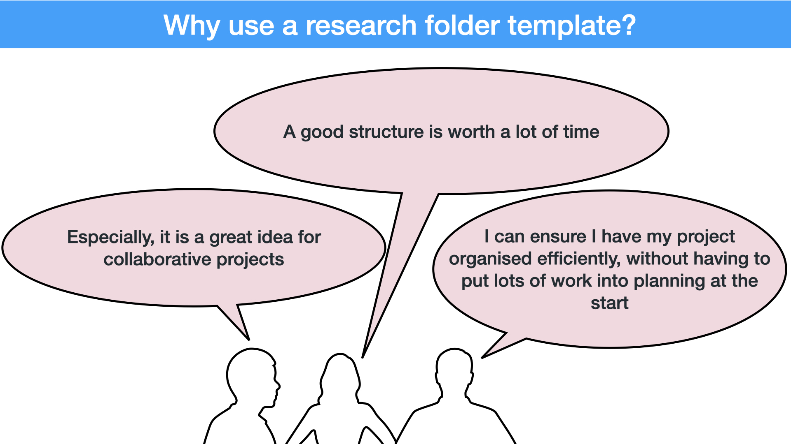

# Summary

With the GIN-Tonic tool, we want to provide researchers with a default file organization and file sharing system for research projects, in order to facilitate research collaboration and lab management.
In contrast to software developers, researchers mostly don't organize their files according to some common standard.
While data managers propose to design and follow such an organisation,
they fail at providing clear recommendations or examples to researchers;
and there is no time specifically assigned to this task in the researcher's work.
We believe that **providing researchers with a commonly accepted folder tree structure template** could make a huge difference in promoting data management and facilitating research collaboration.
In this blog, we present the results of an initial survey run in three neuroscientific collaborative research centers in Germany ([CRC1315](https://www.biologie.hu-berlin.de/en/gruppenseiten-en/sfb1315), [CRC1158](www.sfb1158.de
), [CRC135](http://www.allpsych.uni-giessen.de/sfb/)), including a presentation of a new folder structure and its technical **implementation in the GIN-Tonic application**.
Researchers from all research domains and country of origins are now invited to review this draft in a second survey which runs until February 2021, LINK.  


# Introduction

Every day, researchers spend time doing file management on their computers (creating, downloading, naming, moving, saving, copying, reviewing, navigating, searching for, sharing, and deleting files and folders).
While many different initiatives and tools have tried to improve file management (using tags, databases and search algorithms), the use of a folder tree structure appeared to be unavoidable and necessary [@dinneenUbiquitousDigitalFile2020].
In addition, both proponents of reproducible research and data management experts recommend researchers the use of an appropriate folder organizational structure ([@LibraryCarpentryLcfairresearch2019], [@theturingwaycommunityTuringWayHandbook2019]).
However, only few actually provide examples or attempt to bring uniformity in such structures (see [@vuorreSharingOrganizingResearch2020] and [@wilsonGoodEnoughPractices2017] for exceptions).

We -the authors of this blog post- are data managers of different institutions working with neurobiologists, and we teamed up with the NFDI Neuroscience community to develop a new strategy to support researchers with their data management.
We hypothesize that implementing a hierarchical directory structure using a template could help researchers collaborate on their projects,
and manage their data and files better.


In a first step, 
We collected the feedback from 51 neuroscientists presented with two initial template drafts (see Fig. 1),
analyzed their responses,
and built an updated template (see Fig. 4 and https://doi.org/10.5281/zenodo.3987767 to download the templates).
This new template takes three levels of projects organization into account (experiment, project, and laboratory),
while staying fairly simple and flexible.
This blog ends by outlining the GIN-Tonic application, that brings some technical solution (based on the git submodule technology) to add flexibility and ease of use to the template.


# The survey

## Two template structures

In order to obtain a practical flair in comments and feedback received,
we provided two templates, both having a similar number of folders,
but organized differently. The templates were obtained by analyzing current research workflows discussed during a number of interviews with researchers of the involved consortia.
The **_5_top_** template represented a more hierarchical structure,
while the **_9_top_** template represented a more flat structure (see Fig. 1).
Then, we asked researchers to browse the folder tree while asking them to place or find specific files,
hoping researchers will make themselves familiar with the template before giving us their feedback. 


## No clear preference for one or the other template. 

We ran the survey on the three involved CRCs during autumn 2020 (using the lime survey application) and finally got 51 responses.
In the meantime, we prepared the analysis code using fake data. The analysis was run on the final data to produce a reproducible report.
In general, researchers reacted very positively to our project.
Surprisingly, about half of the participants preferred one template, while the other half preferred the other one (see Fig. 2,
participants had to choose one or the other template).
This preference was highly correlated with the similarity of the template to the structure they currently use (Pearson Chi-square, p−value = 2.23e−06, no correction for multitple tests was performed).
However, we could not identify any notable effect of career stage or research domain on this preference,
or any effect of this preference on willingness to use such a template.
In particular, computer scientists did not seem to differ from wet-lab researchers in these aspects.


We asked three questions about where they would save or search for specific documents in the different structures.
Researchers were indicating different folders, and few chose the folder we designed for that data,
showing that **a too detailed folder structure seems to be rather inconvenient*.
On the other hand, researchers would navigate the repository to find specific files using similar strategies (see Fig. 3),
suggesting that having a structure can be helpful, and may reduce the time to browse for specific information.


## Issues

Most participants see the advantages of having a standardized structure for their files,
but were critical about the **cost to benefit ratio** of the process, especially for ongoing projects.
Many mentioned that it would only reach full impact if the whole lab would be using it, emphasizing the advantage of such a system for
collaborative work.
In addition, they mentioned the time saved by not having to create a template for themselves,
but only use an existing standard.
While they were quite unanimous about using a template for new projects, they were skeptical about making a transition for ongoing projects,
as the cost of transition might be too high.
More generally, they were worried that learning a new workflow to use the template could be time consuming.


In many cases, people mentioned that the **files are organized via experiments**, not at the project level.
In particular, people tend to pool data and code in a single experiment folder.
This is reminiscent of the two example structures given in the library carpentry course [@LibraryCarpentryLcfairresearch2019].


On the other hand, some **files are organized outside of project folders**, that is in particular places irrespective of the project they belong to. 
Many researchers reported having a folder for all conference reports or all manuscripts, for instance.


# The new template

## Template overview

Data management principles recommend (1) to keep all files related to a project in a single folder (this facilitates sharing of these files with the whole team working on the project, for instance),
and (2) to manage data and code differently (this allows different version control systems, as well as independent sharing and reusing of data and code).
We finally designed a template that follows these principles, 
but added some recommendations and technical solutions 
in order to permit users to have laboratory and experiment-level organization of their files, nevertheless.

![Fig.4: Folder structure developed after analyzing the survey. The template works mostly on the project level (one unique folder for all files related to one project). The experiment level is taken care by specifying several experiment sub-folders when new experiments are started. By sharing specific subfolder independently in a cloud solution, one can reorganize information in cross-project directories that host sub-folders coming from different projects. Note that both the creation of experiment sub-folders and the creation of laboratory level organization is automated in GIN-Tonic.](../50_figures/pulication_ready_figures/fig4.png)

```{}
Our definition of the organisation levels:

- Experiment: The unit of research involving a statistically dependent datasets that are analysed together. It mostly produces one figure. Different experiments typically involve different methods, or different samples, and could be ending in different publications. 

- Research project: The unit of research that address a specific research question. It can mostly be deliminated by the team involved and typically produce a unique research paper.

- Laboratory: Any organization that involves files from several projects. It can also be for a unique researcher, or for a consortium of laboratories.

```

## The experiment level


We propose to keep data and code in different first level folders, 
and to create several new folders (new data, analysis, and figure folders) for each new experiment.
In addition, some of these new folders may also follow their own templates.
For instance, some researchers could use a specific BIDS standard template for some imaging experiments.


## The project and laboratory level

We propose to share some sub-folders independently (for shared figures, report and conferences, and manuscripts) in order to be able to have them in the project folder or in a different folder structure merging information coming from different projects. One could for instance create a folder containing all manuscripts prepared in the lab (see Fig. 4).


# Sharing and automation

## Automation possibilities

The creation of different sub-folders for one experiment could easily be automated in your computer language of choice. An automation would make sure that the folder names are kept consistent for each experiment.

Working on the laboratory level is more complex. If one wants to have cross-folder organization locally, one can work with "alias folders", where the user can create shortcuts to specific folders using a different organization. The data exists only once and there is no issues of synchronization. 

The expected use case is different though, and we expect some users to have certain files organized by projects and other users having the same files organised by file type. This requires to share sub-folders independently and set the different instance of these sub-folders to be linked together. This is pretty complex to set up using common cloud technology (dropbox-like) that cannot be easily automated. As explained below, the open source GIN-Tonic tool allows to set it up automatically, using the git submodule technology.

## GIN-Tonic implementation

GIN is the G-Node infrastructure.
It is based on gogs, git and git annex technologies and
 brings non only most of the project management and coordination tools that made the success of open source software development,
but also large file support and data publication.
It is compatible with the git submodule technology, where sub-folders can be synchronized, shared and published independently of the other sub-folders,
while looking completely normal on one's computer.
GIN brings therefore the possibility to publish sub-modules independently of each others, 
which will ease the opening of research data.
It might also make [the use of markdown and LaTex to write manuscripts](https://oa-pub.hos.tuhh.de/en/project/) a straightforward choice, as these technologies can use git as a version control system.


We are building an extension that will facilitate some administrative tasks and automate some complex work-flows linked to the use of the template.
We could not resist calling it Tonic, in reference to the vigor added to the GIN tool. The Tonic tool is still in development, and we we are also working on the implementation of the Tonic concept for GitLab-based platforms (that is, using git and git-LFS), called LAB-Tonic. 

  

The Tonic application creates a new project repository,
cloning the research folder structure (with some folders being created as sub-modules), and adding a script that will synchronize the repository and its sub-modules on a double click. It also adds some submodules (shared-figures, manuscripts, and report_conf) to loboratory-wide repositories, automatically allowing laboratory level organisation of some files.
This means that for example a manuscript draft can be available in the project folder on the student computer, while the same data will be available in the lab_manuscript folder on the PI computer, both version being synchronized with a unique version on the GIN server. 


On the other hand, the Tonic application will also be able to add submodules and folders to the parent repository. For each experiment performed, a data submodule  will be created, so that the data can be curated and published independently of the other experiments, while other normal folders will be created (see Fig. 4). A synchronisation of the computer version will then bring these changes on the local version, showing the new folders ready to be filled with data, code, and figures.


# Conclusion

We hope to provide the research community with a useful project folder structure template. 
A second survey will tell us how wide it could be applied, and whether domain specific templates may be needed.
The template will get its full power when used inside the gin-Tonic application.
Tonic will indeed automate several administrative tasks, like the production of sub-folders upon new experiments,
and come with a predefined rule for sharing one's files in the lab. 


<!---

On one side,
the tool should both separate data and analysis code to follow good practices,
and allow for an experiment-based workflow.
We propose to use a bot to create several folders at different location for each experiment.
On the other side,
researchers normally have more than one project and some documents,
like for example conference presentations,
are better organised outside of the project structure.
We propose to use the git submodule technology to mirror these folders at different location.
Documents will be available on the project structure (for easy sharing and re-use inside a project)
and a different structure (allowing a better overview of specific work).
We finally present an hypothetical use case demonstrating the new paradigm.

--->


# References
